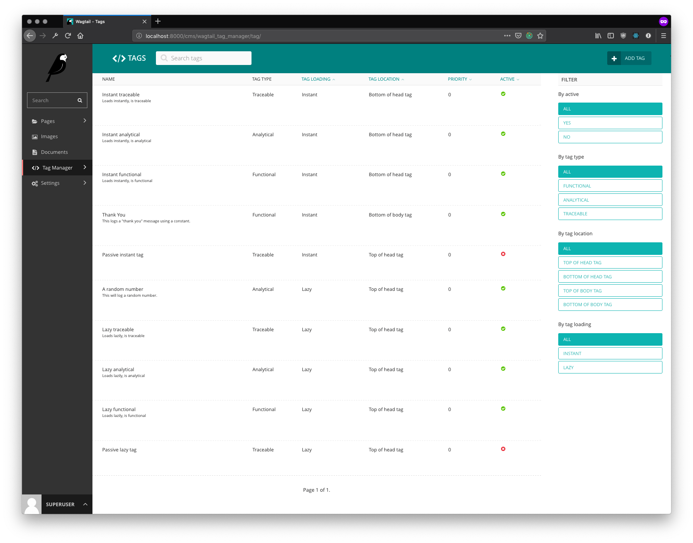
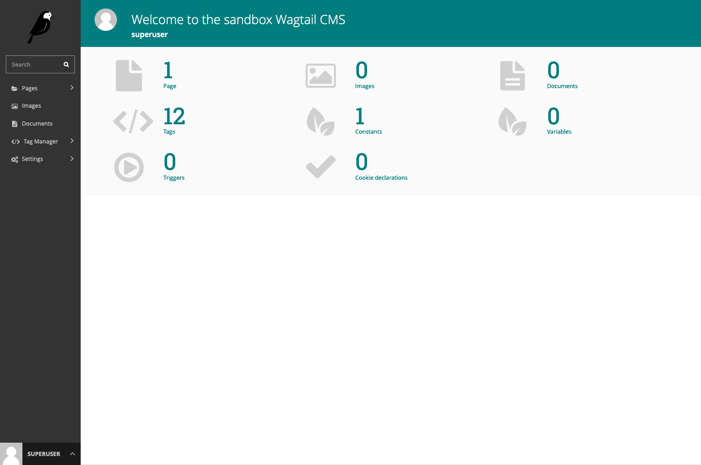
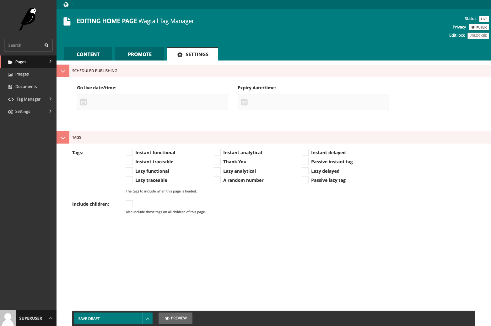

# Wagtail Tag Manager

[![CircleCI][circleci]](https://circleci.com/gh/jberghoef/wagtail-tag-manager)
[![TravisCI][travis]](https://travis-ci.org/jberghoef/wagtail-tag-manager)
[![CodeCov][codecov]](https://codecov.io/gh/jberghoef/wagtail-tag-manager)
[![Codacy][codacy]](https://www.codacy.com/app/jberghoef/wagtail-tag-manager)
[![License][license]](https://opensource.org/licenses/BSD-3-Clause)
[![Fossa][fossa]](https://app.fossa.com/projects/git%2Bgithub.com%2Fjberghoef%2Fwagtail-tag-manager)
[![Version][version]](https://pypi.python.org/pypi/wagtail-tag-manager/)
[![Downloads][downloads]](https://pepy.tech/project/wagtail-tag-manager)
[![Black][black]](https://github.com/ambv/black)
[![Prettier][prettier]](https://github.com/prettier/prettier)

[circleci]: https://circleci.com/gh/jberghoef/wagtail-tag-manager.svg?style=svg "Circle CI"
[travis]: https://travis-ci.org/jberghoef/wagtail-tag-manager.svg?branch=master "Travis CI"
[codecov]: https://codecov.io/gh/jberghoef/wagtail-tag-manager/branch/master/graph/badge.svg "Codecov"
[codacy]: https://api.codacy.com/project/badge/Grade/2a59a006e69442bb809bf08f47028eb9 "Codacy"
[license]: https://img.shields.io/badge/license-BSD-blue.svg "License"
[fossa]: https://app.fossa.com/api/projects/git%2Bgithub.com%2Fjberghoef%2Fwagtail-tag-manager.svg?type=shield "Fossa"
[version]: https://img.shields.io/pypi/v/wagtail-tag-manager.svg "Version"
[downloads]: https://pepy.tech/badge/wagtail-tag-manager "Downloads"
[black]: https://img.shields.io/badge/code%20style-black-000000.svg "Black"
[prettier]: https://img.shields.io/badge/code_style-prettier-ff69b4.svg "Prettier"

Wagtail Tag Manager (WTM for short) is a [Wagtail](https://wagtail.io/) addon
that allows for easier and GDPR compliant administration of scripts and tags.

**Please note that this software is in beta and has not been extensively tested
in practice. Any part of the API may change without notice!**



*In this package the term "tag" is being used for code snippets being injected
into HTML. This is not to be confused with tags used to identify content in the
CMS, such as pictures and documents.*

## Features
Wagtail Tag Manager offers functionality similar to platforms like
**Adobe Dynamic Tag Management**, **Google Tag Manager** and **Tealium iQ**
without the need of a third party. It's fully integrated into Wagtail.

This approach comes with a couple of advantages, most prominently the ability
to inject tags into a page before the response is send to a client.

### Administrators
- Manage scripts and tags from within Wagtail, with powerful options to define load order.
- Store reusable content in constants and variables and easily add them to your tags.
- Create triggers to load tags based on events in the browser.
- Create cookie declarations to provide end-users with a full picture of the tracking taking place.

### Developers
- Create custom variables to give administrators functionality specific to your use-cases.

## Table of content
- [Disclaimer](#disclaimer)
- [Requirements](#requirements)
- [Instructions](#instructions)
- [Template tags](#template-tags)
    - [``wtm_instant_tags``](#wtm_instant_tags)
    - [``wtm_lazy_manager``](#wtm_lazy_manager)
    - [``wtm_cookie_bar``](#wtm_cookie_bar)
    - [``wtm_include``](#wtm_include)
- [Preference management](#preference-management)
- [Context processors](#context-processors)
- [Settings](#settings)
    - [``WTM_TAG_TYPES``](#wtm_tag_types)
    - [``WTM_INJECT_TAGS``](#wtm_inject_tags)
    - [``WTM_MANAGE_VIEW``](#wtm_manage_view)
    - [``WTM_COOKIE_EXPIRE``](#wtm_cookie_expire)
    - [``WTM_CACHE_TIMEOUT``](#wtm_cache_timeout)
    - [``WTM_PRESERVE_VARIABLES``](#wtm_preserve_variables)
    - [``WTM_INJECT_STYLE``](#wtm_inject_style)
    - [``WTM_INJECT_SCRIPT``](#wtm_inject_script)
    - [``WTM_SUMMARY_PANELS``](#wtm_summary_panels)
    - [``WTM_CHROMEDRIVER_URL``](#wtm_chromedriver_url)
- [Custom variables](#custom-variables)
- [Page tag mixin](#page-tag-mixin)
- [Sandbox](#sandbox)
- [Concept](#concept)

## Disclaimer

This package attempts to ease the implementation of tags by the new ePrivacy
rules as defined by the European Union. I urge you to read about these new
rules and ensure you are properly configuring your tags for both the analytical
and traceable variants. This package is free and the author can not be held
responsible for the correctness of your implementation, or the assumptions made
in this package to comply with the new ePrivacy regulation.

Read more about the [ePrivacy Regulation](https://ec.europa.eu/digital-single-market/en/proposal-eprivacy-regulation).

Included in this package is a cookie bar which admittedly provides too little
information to end users regarding the purpose of the scripts you are placing
on the website. For compliance, please use the ``cookie_bar.html`` template to
change the text shown in the cookie bar.

## Requirements

| Package  	|  Version(s)	            |
|---------	|-----------------------	|
| Django  	|  2.0, 2.1, 2.2 	        |
| Wagtail 	|  2.1, 2.2, 2.3, 2.4, 2.5 	|

## Instructions

**Installation:**

```
pip install wagtail-tag-manager
```

**Add the application to your ``INSTALLED_APPS``:**

```python
INSTALLED_APPS = [
    # ...
    'wagtail.contrib.modeladmin',
    'wagtail_tag_manager',
    # ...
]
```

If you wish to enable the cookie bar settings (allowing you to change to title
and text displayed in the cookie bar), also include ``wagtail.contrib.settings``
in the ``INSTALLED_APPS``.

**Include the middleware:**

```python
MIDDLEWARE = [
    # ...
    'wagtail_tag_manager.middleware.TagManagerMiddleware',
    # ...
]
```

WTM offers two ways to implement it's functionality. You can either choose to
use the middleware (which will rewrite the html on each request) or use the
```` and ```` template tags.

If you prefer to use the template tags to inject tags into your templates,
set the ``WTM_INJECT_TAGS`` and ``WTM_INJECT_SCRIPT`` settings to ``False``
and implement the template tags as follows:

```html+django


<head>
    
    ...
    
</head>
<body>
    
    ...
    
    
</body>
```

**Include the urls:**

```python
from django.urls import include, path
from wagtail_tag_manager import urls as wtm_urls

urlpatterns = [
    # ...
    path('wtm/', include(wtm_urls)),
    # ...
    path('', include(wagtail_urls)),
    # ...
]
```

## Template tags

As an alternative to using the middleware you can use the ``wtm_instant_tags``
and ``wtm_lazy_manager`` template tags. Please be sure to use the middleware OR
the template tags, never both.

### ``wtm_instant_tags``

To load all instant tags at once:

```html+django


<head>
    ...
    
</head>
```

To load tags corresponding to a certain position:

```html+django


<head>
    
    ...
    
</head>
<body>
    
    ...
    
</body>
```

### ``wtm_lazy_manager``

```html+django


<body>
    ...
    
</body>
```

Optionally, you can disable either the script and/or the styling.

```html+django


<body>
    ...
    
</body>
```

---

### ``wtm_cookie_bar``


```html+django


<body>
    
    ...
</body>
```

### ``wtm_include``

WTM comes with the `wtm_include` template tag to accommodate loading of
resources and markup based on the tag strategy and consent given. It can be
used as a way to load html, css or javascript files.

```html+django


<body>
    ...
    
    
    
    ...
</body>
```

Alternatively, you can use it as a block:

```html+django


<body>
    ...
    
        <script>
            console.log("Included conditionally");
        </script>
    
    ...
</body>
```

### Preference management

You can use the following provided template tags to render a tag status
overview, a table with cookie declarations or a consent form.

```html+django





```

## Context processors

To enable the context processors, add the following to your settings:

```python
"context_processors": [
    # ...
    "wagtail_tag_manager.context_processors.consent_state",
]
```

You can now use the following value in your templates:

```html+django
{{ wtm_consent_state.functional }}

{{ wtm_consent_state.analytical }}

{{ wtm_consent_state.traceable }}
```

These will return a boolean indicating wether or not tags specific to the
corresponding state should load.

## Settings

### ``WTM_TAG_TYPES``

```python
WTM_TAG_TYPES = {
    # key, verbose name, setting
    "functional": (_("Functional"), "required"),
    "analytical": (_("Analytical"), "initial"),
    "traceable": (_("Traceable"), ""),
}
```

Allows you to define the tag types available. This can be helpful if you'd like
the change the terminology used, or when you'd prefer to split a type in
multiple sections. Notice the two keywords (``required`` and ``initial``) used.

Tags marked as ``required`` can not be disabled and will always be included on
every page.

Tags marked as ``initial`` will be included as long as no explicit consent has
been given by the end user, provided the browser allows cookies. While no
consent has been given, these tags will be loaded lazily to honor the browser
settings (which we can only read using javascript).

The third option is to mark a tag as ``delayed``. This will ensure the tag will
not load on the first page load, but only from the second load forward.

### ``WTM_INJECT_TAGS``

```python
WTM_INJECT_TAGS = True
```

Instructs the middleware to inject all tags marked "instant load" in the
document. Disable this if you would rather use the ````
template tags.

### ``WTM_MANAGE_VIEW``

```python
WTM_MANAGE_VIEW = True
```

Allows you to enable or disable the included "manage" view allowing users to
get insight in the tags running on your site and adjust their preferences.
The view is enabled by default.

### ``WTM_COOKIE_EXPIRE``

```python
WTM_COOKIE_EXPIRE = 365
```

Sets the expiration time in days of WTM's cookies. Notice that this is only
applicable to the consent cookies used by WTM, not any cookies placed by tags.

### ``WTM_CACHE_TIMEOUT``

```python
WTM_CACHE_TIMEOUT = 1800
```

Sets the amount of seconds the cache will be preserved. At the moment,
caching is only applied to constants, which will refresh when a constant is
saved. Default is 30 minutes.

### ``WTM_PRESERVE_VARIABLES``

```python
WTM_PRESERVE_VARIABLES = True
```

Configures whether the variables are preserved for each request, or refreshed
for each tag applied to a response. When set to `False`, a query will be done
for each single tag which will add up quickly.

### ``WTM_INJECT_STYLE``

```python
WTM_INJECT_STYLE = True
```

Change to `False` to prevent WTM's included styles from loading. This is useful
if you wish to style the cookiebar yourself.

### ``WTM_INJECT_SCRIPT``

```python
WTM_INJECT_SCRIPT = True
```

Change to `False` to prevent WTM's included scripts from loading. This is
useful if you don't want to use the inlcuded lazy loading and cookie bar
functionality.

### ``WTM_SUMMARY_PANELS``

```python
WTM_SUMMARY_PANELS = False
```

Disables or enables the summary panels visible on the Wagtail admin dashboard.



### ``WTM_CHROMEDRIVER_URL``

**This is an experimental feature.**

```python
WTM_CHROMEDRIVER_URL = "http://0.0.0.0:4444/wd/hub"
```

Allows configuration of the docker container running an instance of
``selenium/standalone-chrome``.

When developing, use the following command to run the docker container and
ensure that your site is configured be accessible over your computer's public
ip. Otherwise the docker container won't be able to access the website.

https://hub.docker.com/r/selenium/standalone-chrome/

## Custom variables

In addition to managing variables in the admin interface, variables can also be
created in your source code by registering a ``CustomVariable``.

```python
from wagtail_tag_manager.decorators import register_variable
from wagtail_tag_manager.options import CustomVariable

@register_variable
class Variable(CustomVariable):
    name = "Custom variable"
    description = "Returns a custom value."
    key = "custom"

    def get_value(self, request):
        return "This is a custom variable."
```


## Page tag mixin

If you would like to include tags on a page, include the ``TagMixin`` mixin.
Under the "Settings" tab of the corresponding page type a list of tags will be
shown. By selecting these, these tags will be included when the page loads.

Additionally, by selecting the "Include children" field, all descending pages
of the configured page will also load the chosen tags.

Note that the consent state is being applied to these tags. If the selected tag
is marked as, for example, "traceable", the end-user still must allow this type
of tags before is is being injected.

```python
from wagtail_tag_manager.mixins import TagMixin

class HomePage(TagMixin, Page):
    pass
```



## Sandbox

To experiment with the package you can use the sandbox provided in this
repository. To install this you will need to create and activate a
virtualenv and then run ``make sandbox``. This will start a fresh Wagtail
install, with the tag manager module enabled, on http://localhost:8000
and http://localhost:8000/cms/. The superuser credentials are
``superuser`` with the password ``testing``.

Various types of tags, constants and variables are enabled out of the box.
Check out the console in your browser to see them in action.

## Concept

| State                                                        | Functional | Analytical | Continuous | Traceable |
|--------------------------------------------------------------|------------|------------|------------|-----------|
| No cookies accepted.                                         | yes        | no         | no         | no        |
| Cookies implicitly accepted through browser settings.        | yes        | yes        | yes¹       | no        |
| Cookies explicitly accepted, noting tracking functionality.² | yes        | yes        | yes¹       | yes       |

*¹ From the second page load onward.*

*² According to the ePrivacy regulation, mentioning that you are using tracking functionality is mandatory.*

Note that in the case of analytical cookies or local storage, you are obliged
to still show a notification at least once, noting that you are using cookies
for analytical and performance measurement purposes.

When implementing tracking cookies, the user has to explicitly give permission
for you to enable them for their session. When asking for permission, you must
explicitly state the tracking functionality of the script you are using.

To ease the implementation by this concept, Wagtail Tag Manager allows you to
define a tag as functional, analytical of traceable. When properly configured,
it'll take care of loading the correct tag at the correct time, taking in
account the following scenario's:

1. The user has not accepted cookies.

    |         | Functional | Analytical | Continuous | Traceable |
    |---------|------------|------------|------------|-----------|
    | Instant | yes        | no         | no         | no        |
    | Lazy    | yes        | no         | no         | no        |

2. The user has accepted cookies through browser settings.

    |         | Functional | Analytical | Continuous | Traceable |
    |---------|------------|------------|------------|-----------|
    | Instant | yes        | yes¹       | yes²       | no        |
    | Lazy    | yes        | yes        | yes²       | no        |

    *¹ Will be loaded lazily.*

    *² From the second page load onward.*

    As the acceptance of analytical tags can only be verified client side, we'll
    first load all the analytical tags lazy (whether they are instant or not).

    Please note that we still have to show a message stating that we are using
    analytical tags.

3. The user has explicitly accepted cookies for your site.

    |         | Functional | Analytical | Continuous | Traceable |
    |---------|------------|------------|------------|-----------|
    | Instant | yes        | yes        | yes        | yes       |
    | Lazy    | yes        | yes        | yes        | yes       |


[](https://app.fossa.com/projects/git%2Bgithub.com%2Fjberghoef%2Fwagtail-tag-manager?ref=badge_large)
