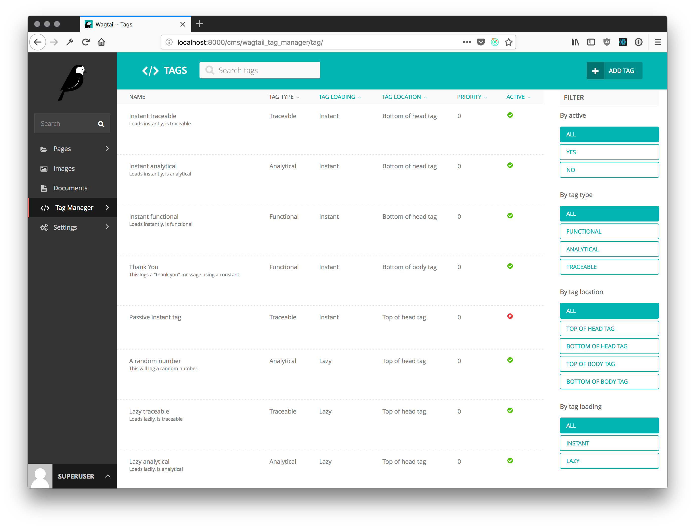

Wagtail Tag Manager
===================

.. image:: https://circleci.com/gh/jberghoef/wagtail-tag-manager.svg?style=svg
    :target: https://circleci.com/gh/jberghoef/wagtail-tag-manager

.. image:: https://codecov.io/gh/jberghoef/wagtail-tag-manager/branch/master/graph/badge.svg
    :target: https://codecov.io/gh/jberghoef/wagtail-tag-manager

.. image:: https://api.codacy.com/project/badge/Grade/2a59a006e69442bb809bf08f47028eb9
    :target: https://www.codacy.com/app/jberghoef/wagtail-tag-manager

.. image:: https://img.shields.io/badge/code%20style-black-000000.svg
    :target: https://github.com/ambv/black

.. image:: https://img.shields.io/badge/code_style-prettier-ff69b4.svg
    :target: https://github.com/prettier/prettier

Wagtail Tag Manager (WTM for short) is a Wagtail_ addon that allows for easier
and GDPR compliant administration of scripts and tags.

**Please note that this software is in beta and has not been extensively tested
in practice.**

.. _Wagtail: https://wagtail.io/

Disclaimer
----------

This package attempts to ease the implementation of tags by the new ePrivacy
rules as defined by the European Union. I urge you to read about these new
rules and ensure you are properly configuring your tags for both the analytical
and traceable variants. This package is free and the author can not be held
responsible for the correctness of your implementation, or the assumptions made
in this package to comply with the new ePrivacy regulation.

Read more about the `ePrivacy Regulation`_.

.. _ePrivacy Regulation: https://ec.europa.eu/digital-single-market/en/proposal-eprivacy-regulation

Included in this package is a cookie bar which admittedly provides too little
information to end users regarding the purpose of the scripts you are placing
on the website. For compliance, please use the ``cookie_bar.html`` template to
change the text shown in the cookie bar.

Requirements
------------

+---------+---------------+
| Django  | 2.0           |
+---------+---------------+
| Wagtail | 2.0, 2.1, 2.2 |
+---------+---------------+

Instructions
------------

Installation::

    pip install wagtail-tag-manager

Add the application to your ``INSTALLED_APPS``:

.. code-block:: python

    INSTALLED_APPS = [
        # ...
        'wagtail.contrib.modeladmin',
        'wagtail_tag_manager',
        # ...
    ]

If you wish to enable the cookie bar settings (allowing you to change to title
and text displayed in the cookie bar), also include ``wagtail.contrib.settings``
in the ``INSTALLED_APPS``.

WTM offers two ways to implement it's functionality. You can either choose to
use the middleware (which will rewrite the html on each request) or use the
```` and ```` template tags.

When using the template tags, you will lose the option to set a document
location for your instant tags (top of ``<head>``, bottom of ``<head>``, top of
``<body>`` and bottom of ``<body>``).

    Option 1: Include the middleware (preferred):

    .. code-block:: python

        MIDDLEWARE = [
            # ...
            'wagtail_tag_manager.middleware.TagManagerMiddleware',
            # ...
        ]

    Option 2: Add these template tags to you're ``base.html`` file:

    .. code-block:: html+django

        

        <head>
            ...
            
        </head>
        <body>
            ...
            
        </body>

Include the urls:

.. code-block:: python

    from django.urls import include, path
    from wagtail_tag_manager import urls as wtm_urls

    urlpatterns = [
        # ...
        path('wtm/', include(wtm_urls)),
        # ...
        path('', include(wagtail_urls)),
        # ...
    ]

Template tags
-------------

**wtm_cookie_bar**

.. image:: cookie-bar-with-form-and-details.png

.. code-block:: html+django

    

    <body>
        
        ...
    </body>

**wtm_include**

WTM comes with the `wtm_include` template tag to accomodate loading of
resources and markup based on the tag strategy and consent given. It can be
used as a way to load html, css or javascript files.

.. code-block:: html+django

    

    <body>
        ...
        
        
        
        ...
    </body>

Alternatively, you can use it as a block:

.. code-block:: html+django

    

    <body>
        ...
        
            
        
        ...
    </body>

**Preference management**

You can use the following provided template tags to render a tag status
overview, a table with cookie declarations or a consent form.

.. code-block:: html+django

    

    

    

Context processors
------------------

To enable the context processors, add the following to your settings:

.. code-block:: python

    "context_processors": [
        # ...
        "wagtail_tag_manager.context_processors.cookie_state",
    ]

**cookie_state**

You can now use the following value in your templates:

.. code-block:: html+django

    {{ wtm_cookie_state.functional }}

    {{ wtm_cookie_state.analytical }}

    {{ wtm_cookie_state.traceable }}

These will return a boolean indicating wether or not tags specific to the
corresponding state should load.

Settings
--------

.. code-block:: python

    WTM_TAG_TYPES = {
        # key, verbose name, setting
        "functional": (_("Functional"), "required"),
        "analytical": (_("Analytical"), "initial"),
        "traceable": (_("Traceable"), ""),
    }

Allows you to define the tag types available. This can be helpful if you'd like
the change the terminology used, or when you'd prefer to split a type in
multiple sections. Notice the two keywords (``required`` and ``initial``) used.

Tags marked as ``required`` can not be disabled and will always be included on
every page.

Tags marked as ``initial`` will be included as long as no explicit consent has
been given by the end user, provided the browser allows cookies. While no
consent has been given, these tags will be loaded lazily to honor the browser
settings (which we can only read using javascript).

.. code-block:: python

    WTM_MANAGE_VIEW = True

Allows you to enable or disable the included "manage" view allowing users to
get insight in the tags running on your site and adjust their preferences.
The view is enabled by default.

.. code-block:: python

    WTM_COOKIE_EXPIRE = 365

Sets the expiration time in days of WTM's cookies. Notice that this is only
applicable to the consent cookies used by WTM, not any cookies placed by tags.

.. code-block:: python

    WTM_CACHE_TIMEOUT = 1800

Sets the amount of seconds the cache will be preserved. At the moment,
caching is only applied to constants, which will refresh when a constant is
saved. Default is 30 minutes.

.. code-block:: python

    WTM_INCLUDE_STYLE = True

Change to `False` to prevent WTM's included styles from loading. This is useful
if you wish to style the cookiebar yourself.

.. code-block:: python

    WTM_INCLUDE_SCRIPT = True

Change to `False` to prevent WTM's included scripts from loading. This is
useful if you don't want to use the inlcuded lazy loading and cookie bar
functionality.

.. code-block:: python

    WTM_COOKIE_SCAN = False

Disables or enables the cookie scan functionality on the cookie declaration
management page. Requires `ChromeDriver`_ to be installed and available in the
path.

.. code-block:: python

    WTM_SUMMARY_PANELS = False

Disables or enables the summary panels visible on the Wagtail admin dashboard.

.. _ChromeDriver: http://chromedriver.chromium.org/

Sandbox
-------

To experiment with the package you can use the sandbox provided in this
repository. To install this you will need to create and activate a
virtualenv and then run ``make sandbox``. This will start a fresh Wagtail
install, with the tag manager module enabled, on http://localhost:8000
and http://localhost:8000/cms/. The superuser credentials are
``superuser@example.com`` with the password ``testing``.

Various types of tags, constants and variables are enabled out of the box.
Check out the console in your browser to see them in action.

Todo
----

- [x] Optimize the middleware and endpoint for performance.
- [ ] Add selenium tests for proper lazy tag testing.
- [ ] Ensure the cookie bar and manage view are accessible.
- [ ] Write user and developer documentation.

Concept
-------

+--------------------------------+------------+------------+-----------+
| State                          | Functional | Analytical | Traceable |
+--------------------------------+------------+------------+-----------+
| No cookies accepted.           | yes        | no         | no        |
+--------------------------------+------------+------------+-----------+
| Cookies implicitly accepted    | yes        | yes        | no        |
| through browser settings.      |            |            |           |
+--------------------------------+------------+------------+-----------+
| Cookies explicitly accepted,   | yes        | yes        | yes       |
| noting tracking functionality. |            |            |           |
+--------------------------------+------------+------------+-----------+

Note that in the case of analytical cookies or local storage, you are obliged
to still show a notification at least once, noting that you are using cookies
for analytical and performance measurement purposes.

When implementing tracking cookies, the user has to explicitly give permission
for you to enable them for their session. When asking for permission, you must
explicitly state the tracking functionality of the script you are using.

To ease the implementation by this concept, Wagtail Tag Manager allows you to
define a tag as functional, analytical of traceable. When properly configured,
it'll take care of loading the correct tag at the correct time, taking in
account the following scenario's:

**1. The user has not accepted cookies.**

+---------+------------+------------+-----------+
|         | Functional | Analytical | Traceable |
+---------+------------+------------+-----------+
| Instant | Yes        | No         | No        |
+---------+------------+------------+-----------+
| Lazy    | Yes        | No         | No        |
+---------+------------+------------+-----------+

**2. The user has accepted cookies through browser settings.**

+---------+------------+------------+-----------+
|         | Functional | Analytical | Traceable |
+---------+------------+------------+-----------+
| Instant | Yes        | Yes*       | No        |
+---------+------------+------------+-----------+
| Lazy    | Yes        | Yes        | No        |
+---------+------------+------------+-----------+

As the acceptance of analytical tags can only be verified client side, we'll
first load all the analytical tags lazy (whether they are instant or not).
On the next request we are able to instantly load the analytical tags marked as
'instant'.

Please note that we still have to show a message stating that we are using
analytical tags.

**3. The user has explicitly accepted tracking cookies for your site.**

+---------+------------+------------+-----------+
|         | Functional | Analytical | Traceable |
+---------+------------+------------+-----------+
| Instant | Yes        | Yes        | Yes*      |
+---------+------------+------------+-----------+
| Lazy    | Yes        | Yes        | Yes       |
+---------+------------+------------+-----------+

We'll load the traceable tags marked 'instant', after the user accepting the
usage of these tags, together with the lazy tags. On the next request we are
able to instantly load the traceable tags marked as 'instant'.
